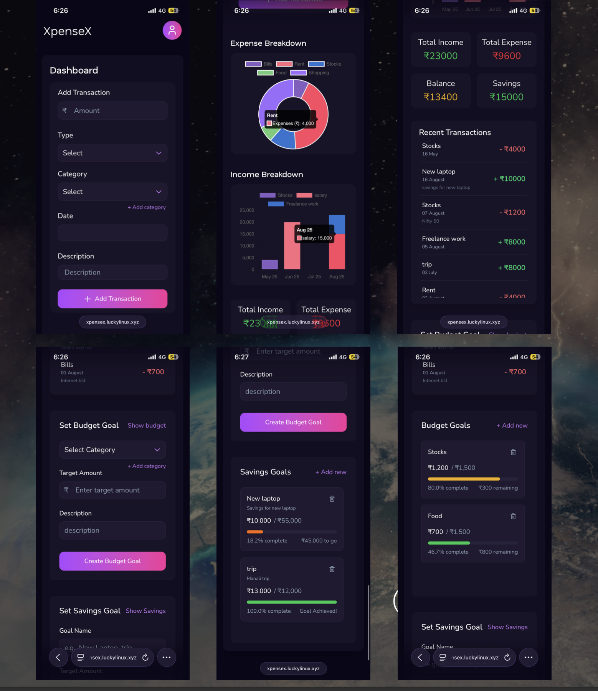

# 💰 XpenseX - Personal Finance Tracker

<div align="center">


*A comprehensive, modern financial management application built with cutting-edge technologies*

[🚀 Live Demo](https://xpensex.luckylinux.xyz) • [📖 Documentation](./DOCUMENTATION.md) • [🐛 Report Bug](https://github.com/KALI-THE-HACKER/xpensex/issues)

</div>

---

## ✨ Overview

XpenseX is a comprehensive personal finance management web application that helps users visualize and manage their finances in one centralized dashboard. Built to address the overwhelming nature of tracking various income sources, expenses, and savings goals, this application provides an intuitive solution for financial management.

### 🎯 Features

- **📊 User-Friendly Dashboard** - Input and categorize income/expenses (rent, groceries, salary, freelance)
- **📈 Visual Data Display** - Charts and graphs for easy financial understanding  
- **🎯 Budget Management** - Set budget limits with notifications when approaching/exceeding limits
- **💰 Savings Goals** - Track progress towards financial objectives (e.g., saving for a laptop)

### 🚀 Enterprise-Grade Implementation
- **🐳 Full Containerization** - Multi-stage Docker builds with zero local dependencies
- **🔄 Automated CI/CD** - GitHub Actions pipeline with Docker Hub integration
- **☁️ Azure Cloud Deployment** - Production-ready infrastructure with monitoring
- **🛡️ Enterprise Security** - Firebase Auth, Cloudflare SSL, environment-based secrets
- **📧 Custom Email Domain** - Integrated Zoho SMTP for professional verification emails
- **📊 DevOps Excellence** - Nginx reverse proxy, health monitoring, automated logging

## 📱 Screenshots

### 🖥️ Desktop Dashboard
<div align="center">


*Complete desktop dashboard showcasing transaction management, visual analytics, budget goals, and savings tracking*

</div>

### 📱 Mobile Experience
<div align="center">



*Mobile-responsive design showcasing all dashboard features optimized for mobile devices*

</div>

---

## 🎥 Video Demonstrations

<div align="center">

*Watch comprehensive video walkthroughs showcasing all features and functionality*

</div>
<div align="center">

[](https://drive.google.com/drive/folders/1Foqa8ZqMrsHjSOcuIJbvbj8mdWoAmwFm?usp=share_link)

</div>


---

## 🛠️ Tech Stack

### **Frontend**
- **⚛️ React 19** - Latest React with concurrent features
- **⚡ Vite 7** - Lightning-fast build tool and dev server
- **🎨 TailwindCSS 4** - Utility-first CSS framework
- **📊 Chart.js** - Beautiful, responsive charts
- **🔥 Firebase SDK** - Authentication and real-time features

### **Backend**
- **🚀 FastAPI** - Modern, fast Python web framework
- **🗄️ MySQL** - Reliable relational database
- **📝 Comprehensive logging** - Application monitoring and debugging
- **🛡️ JWT Authentication** - Secure token-based auth
- **⚡ Uvicorn** - High-performance ASGI server

### **DevOps & Deployment**
- **🐳 Docker** - Multi-stage containerization with production optimization
- **🔄 CI/CD Pipeline** - GitHub Actions with automated Docker Hub deployment
- **⚙️ Container Orchestration** - Docker Compose multi-service management
- **🌐 Nginx Reverse Proxy** - SSL termination and request routing (/ → frontend, /api → backend)
- **☁️ Azure Cloud** - Production VM deployment with monitoring & auto-scaling
- **🔒 Security & SSL** - Cloudflare CDN with automated certificate management

#### 🚀 Deployment Process
1. **Trigger**: Push to main branch initiates workflow
2. **Build**: Multi-architecture Docker images with version tagging
3. **Test**: Automated testing and security scanning
4. **Deploy**: SSH deployment to Azure VM with health validation
5. **Verify**: Post-deployment health checks and rollback capability

#### **🏗️ Deployment Architecture**
```
GitHub → GitHub Actions → Docker Hub → Azure VM → Production
   ↓           ↓             ↓          ↓         ↓
Commit → Build Images → Push Images → Pull & Deploy → Live App
```

## 📉 Problems I faced by building this app

#### Verification email issues

I integrated firebase auth for email verification and encountered issues with the email being sent but marked as spam. To resolve this, I configured my custom email subdomain and setup a SMTP server with the help of Zoho mail - and now those emails are not being marked as spam.

## UI/UX issues

I faced several UI/UX challenges while building the app, including:

1. Too many components that didn't meet size and spacing requirements for desktop version, like in Show budget, set budget, show Saving goals, set saving goals. So I put a simple button in the Show budget/savings component only, to make user switch between see budget/savings and set them.

2. Responsiveness of components: Ensuring all components looked good on different screen sizes required careful planning and testing. I used CSS Grid and Flexbox to create a fluid layout that adapts to various devices.

#### Backend issues

1. User authentication: Initially i was planning to implement JWT auth, but i switched to firebase auth as I had already integrated it for user registration and login.

2. Some minor problems were there with efficiently fetching data from backend and how to efficiently pass it to frontend, but I solved them using some custom formatting functions and algorithms.

#### Docker and DevOps issues

1. Containerization: Initially, my plan was to host the frontend on some third party service like Cloudflare, but later I decided to containerize the entire application using Docker for better scalability, management and integrate CI/CD pipelines from frontend too.

2. Firebase ServiceKeyJson file: It was the most challenging part, managing the Firebase Service Account Key JSON file securely, and to put it inside containers. I was thinking to put it inside container only, but later realized this will expose sensitive information. Then i try putting it directly inside the VM and using environment variables to access it, but again that's not ideal. Finally I decided to convert json code into base64, and then put the base64 encoded string into github secrets(as it allows only strings), and then decoding it again while accessing in backend. Thanks to @vvijay2468 who guided me on how to do this.

3. CI/CD Pipeline: Setting up the GitHub Actions workflow for automated testing and deployment was complex. I had to ensure that all environment variables and secrets were correctly configured to avoid deployment failures.

#### Nginx reverse proxy and SSL termination
My initial Nginx config for reverse proxy was working absolutely fine, but to make it secure i had to put SSL certificates in place. I used Cloudflared to obtain free SSL certificates and configured Nginx to use them for secure HTTPS connections. I could use Let's encrypt also but I found Cloudflared easier to set up and manage, and i've been working with cloudflare for a while, all my services are behind Cloudflare and my domain is also managed by Cloudflare so it made sense to use their SSL as well.

### 🐳 Docker Deployment (Recommended)
```bash
# Quick production deployment
git clone https://github.com/KALI-THE-HACKER/xpensex.git
cd xpensex
# Configure your environment - setup .env file
docker-compose -f docker-compose.yml up -d

# Application available at http://localhost
```

### 🔧 Manual Development Setup

#### Prerequisites
- **Node.js** (v18+), **Python** (3.9+), **Docker & Docker Compose**

#### Backend Setup
```bash
cd backend && pip install -r requirements.txt
# Configure .env with database and Firebase credentials
uvicorn app.xpensex:app --host 0.0.0.0 --port 8000
```

#### Frontend Setup
```bash
cd frontend && npm install
# Configure .env with API endpoint
npm run dev
# Application available at http://localhost:5173
```

## ⚙️ Configuration

### Environment Variables
```bash
# Backend (.env)
DB_HOST=localhost
DB_PORT=3306
DB_USER=your_username
DB_PASSWORD=your_password
DB_NAME=xpensex
FIREBASE_KEY_BASE64=<base64-encoded-firebase-credentials>

# Frontend (.env)
VITE_API_URL=http://localhost:8000 #backend url
```

## 🤝 Contributing

We welcome contributions! Please follow these steps:

1. **Fork the repository**
2. **Create your feature branch** (`git checkout -b feature/AmazingFeature`)
3. **Commit your changes** (`git commit -m 'Add some AmazingFeature'`)
4. **Push to the branch** (`git push origin feature/AmazingFeature`)
5. **Open a Pull Request**

Please ensure your code follows our coding standards and includes appropriate tests.

## 📄 License

This project is licensed under the MIT License - see the [LICENSE](LICENSE) file for details.

## 👨‍💻 Author

**Lucky Verma**
- GitHub: [@KALI-THE-HACKER](https://github.com/KALI-THE-HACKER)
- Website: [luckylinux.xyz](https://luckylinux.xyz)

## 🙏 Acknowledgments

- **Firebase** for authentication services
- **Chart.js** for beautiful data visualizations  
- **TailwindCSS** for the amazing utility-first CSS framework
- **FastAPI** for the incredible Python web framework
- **React team** for the robust frontend library
- **Zoho mail** for free smtp server for my custom mail domain
- **Cloudflare** for securing my domain, providing SSL certificates, and DDoS protection.

---

<div align="center">

**⭐ Star this repository if you find it helpful!**

Made with ❤️ by [Lucky Verma](https://github.com/KALI-THE-HACKER)

</div>