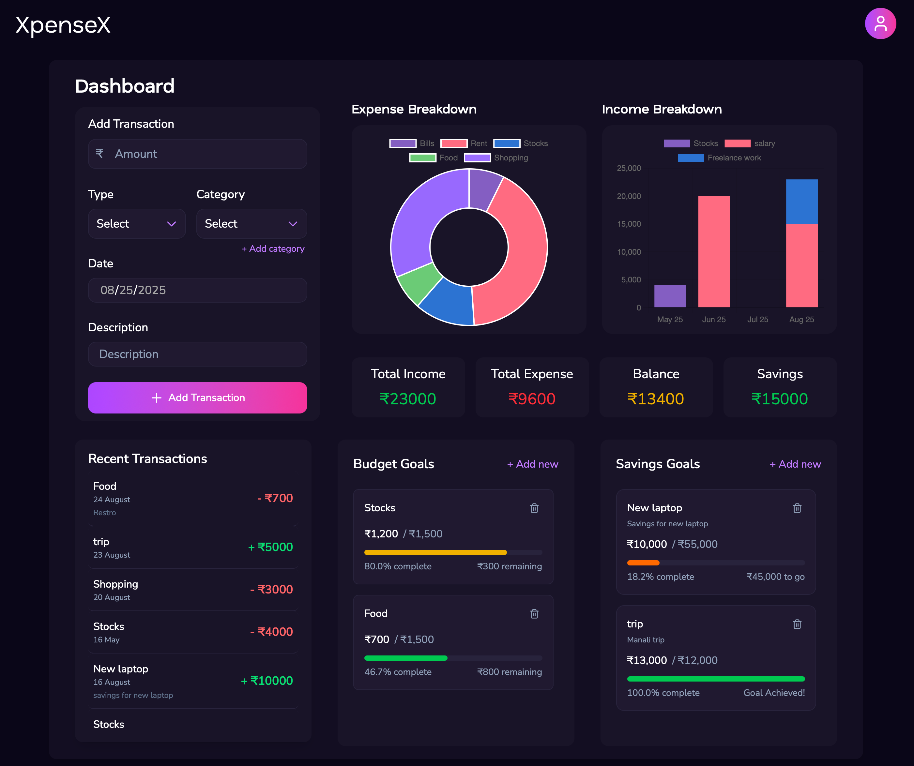

# 💰 XpenseX - Personal Finance Tracker
- **📧 Custom Email Domain** - Integrated Zoho SMTP for professional verification emails
- **📊 DevOps Excellence** - Nginx reverse proxy, health monitoring, automated logging

## 📱 Screenshots

<div align="center">



*Complete dashboard showcasing transaction management, visual analytics, budget goals, and savings tracking*

</div>

---

<div align="center">


*A comprehensive, modern financial management application built with cutting-edge technologies*

[🚀 Live Demo](https://xpensex.luckylinux.xyz) • [📖 Documentation](./DOCUMENTATION.md) • [🐛 Report Bug](https://github.com/KALI-THE-HACKER/xpensex/issues)

</div>

---

## ✨ Overview

XpenseX is a comprehensive personal finance management web application that helps users visualize and manage their finances in one centralized dashboard. Built to address the overwhelming nature of tracking various income sources, expenses, and savings goals, this application provides an intuitive solution for financial management.

### 🎯 Problem Solved
Managing personal finances can be overwhelming with various income sources, expenses, and savings goals to track. XpenseX provides a simple yet effective solution that helps users visualize and manage their finances in one place with:

- **📊 User-Friendly Dashboard** - Input and categorize income/expenses (rent, groceries, salary, freelance)
- **📈 Visual Data Display** - Charts and graphs for easy financial understanding  
- **🎯 Budget Management** - Set budget limits with notifications when approaching/exceeding limits
- **💰 Savings Goals** - Track progress towards financial objectives (e.g., saving for a laptop)

### 🚀 Enterprise-Grade Implementation
- **🐳 Full Containerization** - Multi-stage Docker builds with zero local dependencies
- **🔄 Automated CI/CD** - GitHub Actions pipeline with Docker Hub integration
- **☁️ Azure Cloud Deployment** - Production-ready infrastructure with monitoring
- **🛡️ Enterprise Security** - Firebase Auth, Cloudflare SSL, environment-based secrets
- **� Custom Email Domain** - Integrated Zoho SMTP for professional verification emails
- **�📊 DevOps Excellence** - Nginx reverse proxy, health monitoring, automated logging

<!-- After Stable release
## 📱 Screenshots
<div align="center">
  
| Dashboard Overview | Transaction Management |
|:--:|:--:|
|  |  |

| Budget Goals | Savings Tracker |
|:--:|:--:|
|  |  |

</div>

-->

## 🚀 Features

### 💳 **Transaction Management**
- ✅ **Multi-category tracking** - Expense, Income, and Savings transactions
- ✅ **Smart categorization** - Automatic category suggestions and custom categories
- ✅ **Real-time updates** - Instant synchronization across all components
- ✅ **Detailed descriptions** - Add notes and context to transactions

### 📊 **Visual Analytics**
- ✅ **Interactive charts** - Beautiful Chart.js visualizations
- ✅ **Monthly breakdowns** - Current month vs historical data
- ✅ **Category-wise analysis** - Pie charts and bar graphs
- ✅ **Income vs Expense trends** - Multi-period comparison
- ✅ **Real-time dashboard tiles** - Balance, savings, income, and expense summaries

### 🎯 **Goal Management**
- ✅ **Budget goals** - Set monthly spending limits per category
- ✅ **Savings goals** - Track progress toward financial objectives
- ✅ **Progress tracking** - Visual progress bars with color-coded alerts
<!-- Under Development
- ✅ **Goal notifications** - Smart alerts when approaching limits
- ✅ **CRUD operations** - Create, read, update, and delete goals
-->

### 🔐 **Security & Authentication**
- ✅ **Firebase Authentication** - Secure email/password login with custom domain integration
- ✅ **Custom Email Domain** - Professional verification emails via Zoho SMTP server
- ✅ **Email verification** - Required email confirmation for new accounts
- ✅ **Password reset** - Secure password recovery via custom domain email
- ✅ **JWT token validation** - Server-side authentication verification

### 🎨 **User Experience**
- ✅ **Fully responsive design** - Mobile-first approach with desktop optimization
- ✅ **Dark theme UI** - Modern gradient-based design

### ⚙️ **Technical Features**
- ✅ **RESTful API** - Well-structured backend with comprehensive endpoints
- ✅ **Database persistence** - MySQL with optimized queries
- ✅ **Containerized deployment** - Docker and Docker Compose support
- ✅ **Reverse proxy** - Nginx for production deployment
- ✅ **Comprehensive logging** - Detailed application and error logging

## 🛠️ Tech Stack

### **Frontend**
- **⚛️ React 19** - Latest React with concurrent features
- **⚡ Vite 7** - Lightning-fast build tool and dev server
- **🎨 TailwindCSS 4** - Utility-first CSS framework
- **📊 Chart.js** - Beautiful, responsive charts
- **🔥 Firebase SDK** - Authentication and real-time features

### **Backend**
- **🚀 FastAPI** - Modern, fast Python web framework
- **🗄️ MySQL** - Reliable relational database
- **📝 Comprehensive logging** - Application monitoring and debugging
- **🛡️ JWT Authentication** - Secure token-based auth
- **⚡ Uvicorn** - High-performance ASGI server

### **DevOps & Deployment**
- **🐳 Docker** - Multi-stage containerization with production optimization
- **🔄 CI/CD Pipeline** - GitHub Actions with automated Docker Hub deployment
- **⚙️ Container Orchestration** - Docker Compose multi-service management
- **🌐 Nginx Reverse Proxy** - SSL termination and request routing (/ → frontend, /api → backend)
- **☁️ Azure Cloud** - Production VM deployment with monitoring & auto-scaling
- **🔒 Security & SSL** - Cloudflare CDN with automated certificate management

## � Deployment & CI/CD

### 🔄 Automated Pipeline
Our GitHub Actions workflow automatically:
1. **Builds** optimized Docker images on every commit to main
2. **Pushes** versioned images to Docker Hub registry  
3. **Deploys** to Azure VM with zero-downtime rolling updates
4. **Validates** deployment health and enables rollback if needed

### ☁️ Azure Production Environment
- **Azure VM**: Ubuntu 22.04 LTS (Standard B2s - 2 vCPUs, 4GB RAM)
- **SSL/CDN**: Cloudflare integration with automated certificate management
- **Monitoring**: Comprehensive logging and health checks across all services
- **Security**: Firewall rules, DDoS protection, and environment-based secrets

#### 🔐 Required GitHub Secrets
For the CI/CD pipeline to work, configure these secrets in your GitHub repository:
```bash
DOCKER_USERNAME=your_dockerhub_username
DOCKER_PASSWORD=your_dockerhub_password
AZURE_HOST=your_azure_vm_ip
AZURE_USERNAME=your_azure_vm_username  
AZURE_SSH_KEY=your_private_ssh_key
```

#### 🚀 Deployment Process
1. **Trigger**: Push to main branch initiates workflow
2. **Build**: Multi-architecture Docker images with version tagging
3. **Test**: Automated testing and security scanning
4. **Deploy**: SSH deployment to Azure VM with health validation
5. **Verify**: Post-deployment health checks and rollback capability

#### **🏗️ Deployment Architecture**
```
GitHub → GitHub Actions → Docker Hub → Azure VM → Production
   ↓           ↓             ↓          ↓         ↓
Commit → Build Images → Push Images → Pull & Deploy → Live App
```

### 🐳 Docker Deployment (Recommended)
```bash
# Quick production deployment
git clone https://github.com/KALI-THE-HACKER/xpensex.git
cd xpensex
cp .env.example .env  # Configure your environment
docker-compose -f docker-compose.prod.yml up -d

# Application available at https://your-domain.com
```

### 🔧 Manual Development Setup

#### Prerequisites
- **Node.js** (v18+), **Python** (3.9+), **Docker & Docker Compose**

#### Backend Setup
```bash
cd backend && pip install -r requirements.txt
# Configure .env with database and Firebase credentials
uvicorn app.xpensex:app --host 0.0.0.0 --port 8000
```

#### Frontend Setup
```bash
cd frontend && npm install
# Configure .env with API endpoint
npm run dev
```

## ⚙️ Configuration

### Environment Variables
```bash
# Backend (.env)
DB_HOST=localhost
DB_PORT=3306
DB_USER=your_username
DB_PASSWORD=your_password
DB_NAME=xpensex
FIREBASE_KEY_BASE64=<base64-encoded-firebase-credentials>

# Frontend (.env)
VITE_API_URL=/api
```

## 🚀 Architecture & DevOps

### 🔧 Production Stack
- **Frontend**: React 19 + Vite 7 + TailwindCSS 4
- **Backend**: FastAPI + MySQL 8.0 + Firebase Auth (Custom Domain)
- **Email Service**: Zoho SMTP integration for professional verification emails
- **Infrastructure**: Docker + Nginx + Azure + Cloudflare
- **CI/CD**: GitHub Actions + Docker Hub + Automated deployment

## 🤝 Contributing

We welcome contributions! Please follow these steps:

1. **Fork the repository**
2. **Create your feature branch** (`git checkout -b feature/AmazingFeature`)
3. **Commit your changes** (`git commit -m 'Add some AmazingFeature'`)
4. **Push to the branch** (`git push origin feature/AmazingFeature`)
5. **Open a Pull Request**

Please ensure your code follows our coding standards and includes appropriate tests.

## 📄 License

This project is licensed under the MIT License - see the [LICENSE](LICENSE) file for details.

## 👨‍💻 Author

**Lucky Verma**
- GitHub: [@KALI-THE-HACKER](https://github.com/KALI-THE-HACKER)
- Website: [luckylinux.xyz](https://luckylinux.xyz)

## 🙏 Acknowledgments

- **Firebase** for authentication services
- **Chart.js** for beautiful data visualizations  
- **TailwindCSS** for the amazing utility-first CSS framework
- **FastAPI** for the incredible Python web framework
- **React team** for the robust frontend library

---

<div align="center">

**⭐ Star this repository if you find it helpful!**

Made with ❤️ by [Lucky Verma](https://github.com/KALI-THE-HACKER)

</div>
